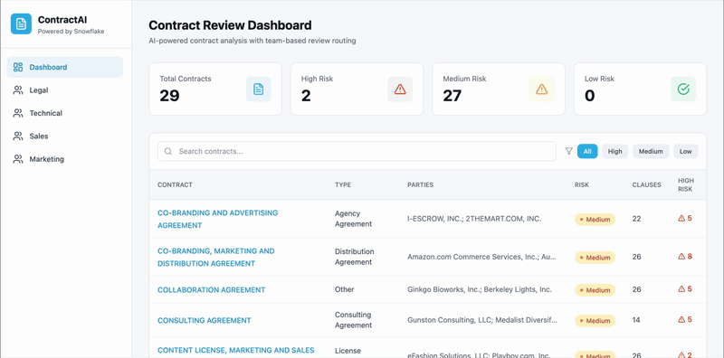
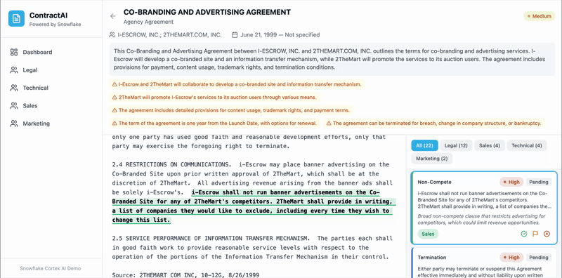

# Legal Contract Review Demo

AI-powered contract review application built on Snowflake. Uses Cortex AI to extract and classify clauses by responsible team, highlight risky passages, and route review tasks to the right people — because legal teams often lack the technical or commercial expertise to review every clause.

## Demo

**Dashboard** — contract list with AI-extracted risk scores, team queues, and search/filter:



**Contract detail** — full contract text with highlighted clauses, click-to-scroll navigation, and Approve / Flag / Reject review actions:



---

## Architecture

```
React 18 + Tailwind CSS  ←→  Flask + Snowpark Python  ←→  Snowflake Cortex AI
                                      ↕
                         LEGAL_CONTRACT_DEMO (Snowflake DB)
                           RAW.CONTRACT_TEXT
                           ANALYTICS.CLAUSE_ANALYSIS
                           ANALYTICS.CONTRACT_SUMMARY
                           EXPERIMENTS.* (experiment runs, metrics, ground truth)
```

Deployed as a single Docker container on **Snowpark Container Services (SPCS)**.

---

## Prerequisites

- Snowflake account with:
  - **SYSADMIN** access — for database, schema, table, and stage setup
  - **ACCOUNTADMIN** access — required for SPCS compute pool creation
  - Cortex AI and SPCS enabled on the account
- [Snowflake CLI](https://docs.snowflake.com/en/developer-guide/snowflake-cli/index) (`snow`) configured with a named connection
- Docker Desktop
- Python 3.11+
- Node.js 20+ and npm

---

## Step 1 — Get the Dataset

This demo uses the **CUAD v1** dataset — 510 commercial contracts with 41 labeled clause categories.

1. Go to **https://www.atticusprojectai.org/cuad/**
2. Download `CUAD_v1.zip` (the full dataset)
3. Extract it into the repo root so the structure is:

```
legal_demo/
└── CUAD_v1/
    └── full_contract_txt/
        ├── OFFICESPACE-LICENSE...
        ├── ...
```

The `CUAD_v1/` directory is gitignored — it stays local only.

---

## Step 2 — Snowflake Setup

Set your connection name once and use it for all subsequent steps:

```bash
export SNOWFLAKE_CONNECTION_NAME=<your-snow-cli-connection-name>
```

Run the database setup (requires SYSADMIN):

```bash
snow sql -f snowflake/setup.sql --connection $SNOWFLAKE_CONNECTION_NAME
```

> **Note:** Edit `snowflake/setup.sql` if your warehouse is not named `COMPUTE_WH`.

---

## Step 3 — Load and Analyze Contracts

Curate ~30 representative contracts from the dataset, load them into Snowflake, and run Cortex AI analysis:

```bash
# Select representative contracts across contract types
python scripts/curate_contracts.py

# Load contract text into RAW.CONTRACT_TEXT
python scripts/load_contracts.py

# Extract clauses with AI risk scoring (~665 clauses)
# Default method uses CORTEX.COMPLETE; use --method hybrid for AI_EXTRACT + AI_CLASSIFY
python scripts/run_analysis.py
python scripts/run_analysis.py --method hybrid   # alternative pipeline

# Generate contract-level summaries (only needed with --method complete)
python scripts/run_summaries.py
```

Each script reads `SNOWFLAKE_CONNECTION_NAME` from the environment. The `--method complete` pipeline calls `SNOWFLAKE.CORTEX.COMPLETE` with `mistral-large2` (~10–20 min). The `--method hybrid` pipeline uses `AI_EXTRACT` + `AI_CLASSIFY` SQL functions for set-based extraction and classification.

---

## Experimentation Module

Compare AI pipeline methods (COMPLETE vs AI_EXTRACT vs hybrid) against CUAD ground truth:

```bash
# Set up the experiments schema (first time only)
snow sql -f snowflake/experiments_setup.sql --connection $SNOWFLAKE_CONNECTION_NAME

# Load CUAD ground-truth annotations
python scripts/load_ground_truth.py

# Run experiments (all methods, or pick one)
python scripts/run_experiments.py --method all
python scripts/run_experiments.py --method complete --limit 5  # quick test

# Evaluate results against ground truth
python scripts/evaluate_results.py --all
```

View results in the app at `/experiments` or query directly:

```sql
SELECT rm.METHOD, rm.TOTAL_WALL_TIME_SECS,
       AVG(CASE WHEN em.METRIC_NAME = 'clause_detection_f1' THEN em.METRIC_VALUE END) AS AVG_F1
FROM LEGAL_CONTRACT_DEMO.EXPERIMENTS.RUN_METADATA rm
JOIN LEGAL_CONTRACT_DEMO.EXPERIMENTS.EVAL_METRICS em ON rm.RUN_ID = em.RUN_ID
GROUP BY rm.METHOD, rm.TOTAL_WALL_TIME_SECS;
```

---

## Step 4 — Build the Docker Image

```bash
# Must use linux/amd64 for SPCS
docker build --platform linux/amd64 -t contract-review-app:latest -f deploy/Dockerfile .
```

---

## Step 5 — Push Image to Snowflake Registry

```bash
# Login to your account's image registry
snow spcs image-registry login --connection $SNOWFLAKE_CONNECTION_NAME

# Get your registry URL
snow spcs image-registry url --connection $SNOWFLAKE_CONNECTION_NAME
# e.g. <account>.registry.snowflakecomputing.com

REGISTRY=<your-registry-url>
docker tag contract-review-app:latest $REGISTRY/legal_contract_demo/app/image_repo/contract-review-app:latest
docker push $REGISTRY/legal_contract_demo/app/image_repo/contract-review-app:latest
```

---

## Step 6 — Deploy to SPCS

Run the SPCS setup (requires ACCOUNTADMIN for compute pool creation):

```bash
snow sql -f snowflake/spcs_setup.sql --connection $SNOWFLAKE_CONNECTION_NAME
```

Check service status and get the public URL:

```sql
SELECT SYSTEM$GET_SERVICE_STATUS('LEGAL_CONTRACT_DEMO.APP.CONTRACT_REVIEW_SERVICE');
SHOW ENDPOINTS IN SERVICE LEGAL_CONTRACT_DEMO.APP.CONTRACT_REVIEW_SERVICE;
```

The app is accessible at the public endpoint shown in `SHOW ENDPOINTS`.

---

## Local Development

```bash
# Backend (Flask)
cd backend
pip install -r requirements.txt
SNOWFLAKE_CONNECTION_NAME=<conn> python app.py

# Frontend (separate terminal)
cd frontend
npm install
npm run dev
```

Frontend dev server runs on port 5173, proxying API calls to Flask on port 5000.

---

## Project Structure

```
legal_demo/
├── snowflake/
│   ├── setup.sql              # Database, schemas, tables, stages (SYSADMIN)
│   ├── experiments_setup.sql  # Experiments schema + tables
│   └── spcs_setup.sql         # Compute pool and service (ACCOUNTADMIN)
├── backend/
│   ├── app.py              # Flask API
│   ├── snowflake_utils.py  # Snowpark session (local + SPCS OAuth)
│   └── requirements.txt
├── frontend/
│   └── src/
│       └── components/     # React components
├── deploy/
│   ├── Dockerfile          # Multi-stage build (Node + Python)
│   └── contract_review.yaml # SPCS service spec
└── scripts/
    ├── curate_contracts.py      # Select ~30 contracts from CUAD
    ├── load_contracts.py        # Load into Snowflake
    ├── run_analysis.py          # Cortex AI clause extraction (--method complete|hybrid)
    ├── run_summaries.py         # Cortex AI contract summaries
    ├── run_experiments.py       # Experiment runner (all pipeline methods)
    ├── evaluate_results.py      # Scoring vs CUAD ground truth
    ├── load_ground_truth.py     # Parse CUAD_v1.json into Snowflake
    ├── pipeline_ai_extract.sql  # AI_EXTRACT-based pipeline SQL
    └── pipeline_ai_classify.sql # AI_CLASSIFY step SQL
```

---

## Team Routing

Clauses are automatically routed for review based on type:

| Team | Clause Categories |
|---|---|
| Legal | Governing Law, Anti-Assignment, Change of Control, Termination for Convenience, ... |
| Technical/Ops | IP Ownership, License Grant, Source Code Escrow, Warranty Duration, ... |
| Sales | Revenue/Profit Sharing, Exclusivity, Non-Compete, Audit Rights, ... |
| Marketing | Unlimited License, Irrevocable License, No-Solicit of Customers, ... |
